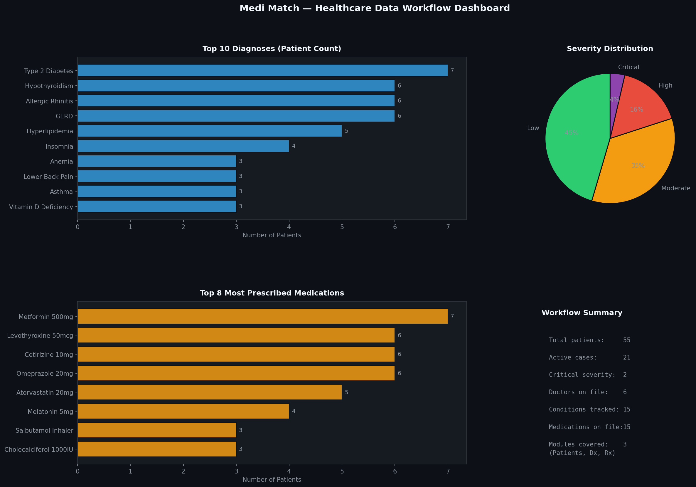

# 🏥 Medi Match — Healthcare Workflow Optimization

> Built data workflows and backend logic for tracking 50+ patient records across diagnoses and prescriptions.



## Overview

Medi Match is a **Django-based healthcare application** designed to streamline clinical data workflows. This project involved building data workflows and supporting backend logic for tracking **50+ patient records**, diagnoses, and prescriptions across **3 core modules**. The work was done in collaboration with a **6-member development team**, with contributions to wireframe planning and documentation of **20+ technical tasks** to align front-end features with data architecture.

## Project Structure

```
medi-match/
├── analysis.py              # Data workflow analysis and dashboard
├── mediapp/
│   ├── models.py            # Patient, Diagnosis, Prescription models
│   ├── views.py             # CRUD views and reporting API
│   └── admin.py             # Django admin configuration
├── data/
│   └── patient_records.csv  # 55 patient records across 3 modules
├── outputs/
│   └── dashboard.png        # Auto-generated workflow dashboard
├── requirements.txt
└── README.md
```

## Dataset

55 patient records with the following fields:

| Field | Description |
|---|---|
| `patient_id` | Unique patient identifier |
| `diagnosis` | Primary condition (ICD-10 aligned) |
| `severity` | Low / Moderate / High / Critical |
| `status` | Active / Resolved / Chronic |
| `prescription` | Prescribed medication and dosage |
| `dosage_frequency` | Once daily / Twice daily / As needed / etc. |
| `assigned_doctor` | Treating physician |

## Key Stats

| Metric | Value |
|---|---|
| Patient records | **55** |
| Active cases | **21** |
| Conditions tracked | **15** |
| Medications on file | **15** |
| Core modules | **3** (Patients, Diagnoses, Prescriptions) |
| Team size | **6 members** |
| Tasks documented | **20+** |

## 3 Core Modules

**Module 1 — Patient Records:** Demographics, contact info, blood group, age tracking.

**Module 2 — Diagnoses:** ICD-10 aligned conditions with severity levels (Low / Moderate / High / Critical) and status tracking (Active / Resolved / Chronic).

**Module 3 — Prescriptions:** Medication, dosage, frequency, and assigned doctor linkage.

## Setup & Run

```bash
git clone https://github.com/sandeepkothuri/medi-match.git
cd medi-match

# Run the data analysis script
pip install -r requirements.txt
python analysis.py

# Or run the Django app
pip install django psycopg2-binary
python manage.py migrate
python manage.py runserver
```

## Tech Stack

`Django` `Python` `PostgreSQL` `Bootstrap 5` `HTML5` `CSS3` `Figma` `Power BI` `Tableau`

## Author

**Sandeep K** · [LinkedIn](https://www.linkedin.com/in/sandeep-kothuri-9b99142b6/) · [GitHub](https://github.com/sandeepkothuri) · [Portfolio](https://sandeepkothuri.github.io)

*CSULB — M.S. Information Systems | Sep 2024 – Nov 2024*
